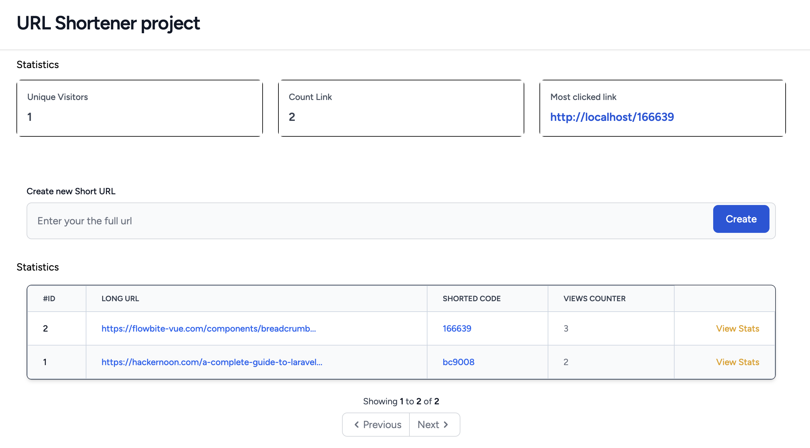

# SquaHR URL Shortener Coding challenge

This project is my solution for the Coding Challenge proposed by SquaHR

## Demo

### Home page


### URL Stats page


## What the project is about?

Build a URL shortener web application using Laravel and Vue.js.
The application should
allow users to shorten long URLs into shorter, more manageable ones.
Implement the
following features:

1. Accept a long URL input from the user.
2. Generate a unique short URL for the given long URL.
3. Store the mapping between the short URL and the original long URL.
4. Redirect users to the original URL when they access the short URL.
5. Display a list of previously shortened URLs with their corresponding statistics (e.g.,
   click count).
6. Show basic stats about URL visits, most visited URLs

## Description of the used stack

### Laravel

Laravel is an open-source PHP web framework.
It follows the MVC (Model-View-Controller) design pattern and provides an expressive and elegant syntax,
making it easy to develop robust and scalable web applications.
Laravel offers built-in features such as database management,
session handling, authentication, form validation, and more.
It promotes clean and well-structured development practices.

### Laravel Sail package

Laravel Sail is a lightweight command-line interface (CLI) for managing development environments using Docker. It provides a pre-packaged Docker configuration specifically tailored for Laravel applications. Sail streamlines the setup process by handling the installation and configuration of the necessary services, such as a web server, database, and caching. It enables developers to quickly set up a consistent and portable development environment.

### MySQL Database

MySQL is a popular open-source relational database management system.
It is commonly used with web applications to store and manage data.
MySQL provides stability, good performance, and comprehensive SQL language support.
It efficiently handles data operations such as create, read, update, and delete (CRUD)

### VueJS 3

Vue.js is a progressive JavaScript framework for building user interfaces.
Vue.js 3, the latest version,
offers enhanced performance and a more efficient reactivity system compared to its predecessors.
It focuses on creating reusable components and provides a reactive approach for manipulating the Document Object Model
(DOM).
Vue.js simplifies the creation of interactive user interfaces,
supports advanced features like routing and state management, and can be easily integrated into existing applications.

### InertiaJs

InertiaJs is a library that allows you to build web applications by seamlessly combining backend frameworks
(like Laravel) with frontend frameworks
(like Vue.js).
It eliminates the need for creating a RESTFul API
or using AJAX calls to communicate between the frontend and backend parts of the application.
Inertia uses the JSON protocol to send data and maintain application state,
simplifying development and improving performance.

## How to start the project

The project has been scaffolded using Laravel sails

1. Clone the project
    ```shell
    git clone https://github.com/denisakp/SquaHR_url_shortener.git
    cd SquaHR_url_shortener
    ```

2. Install composer dependencies
    ```shell
    composer install
    ```

3. Install Npm dependencies
    ```shell
    npm i
    ```

4. Create e .env file and update its content if needed
    ```shell
    cp .env.example .env
    ```

5. Generate Laravel APP Key
    ```shell
    php artisan key:generate --ansi
    ```

6. Run migrations
    ```shell
    php artisan migrate
    ```

7. Start Laravel server
    ```shell
    php artisan serve
    ```

8. Start Node.js development server
    ```shell
    npm run dev
    ```

9. Open your browser at http://localhost:8000

## Dockerized environment

If you have familiar with Docker, here are the steps you must follow

1. Clone the project
    ```shell
    git clone https://github.com/denisakp/SquaHR_url_shortener.git
    cd SquaHR_url_shortener
    ```
2. Create e .env file and update its content if needed
    ```shell
    cp .env.example .env
    ```

3. Generate Laravel APP Key
    ```shell
    php artisan key:generate --ansi
    ```

4. Everything has already been configured, so just run the following command to start the Dev environment
    ``` shell
    ./vendor/bin/sail up
    ```
5. Open a new Tab in your terminal and run the migration
    ```shell
    ./vendor/bin/sail artisan migrate
    ``` 
6. Start the Node.js development server
    ```shell
    ./vendor/bin/sail npm run dev
    ```
7. Open your browser at http://localhost

# Conclusion

By combining Laravel, MySQL, Vue.js, Inertia, and Laravel Sail, I have developed a URL shortener application with a robust backend, efficient data management using MySQL, an interactive user interface powered by Vue.js, and seamless frontend-backend communication facilitated by Inertia. Laravel Sail further simplifies the setup and management of my development environment.

# Feature to add maybe later

- [ ] Make the provided link updatable
- [ ] Get a new shorted code for an existing url
- [ ] Save the user device metadata for analytics purposes
- [ ] share the shorted link on social networks
- [ ] export data in csv format
